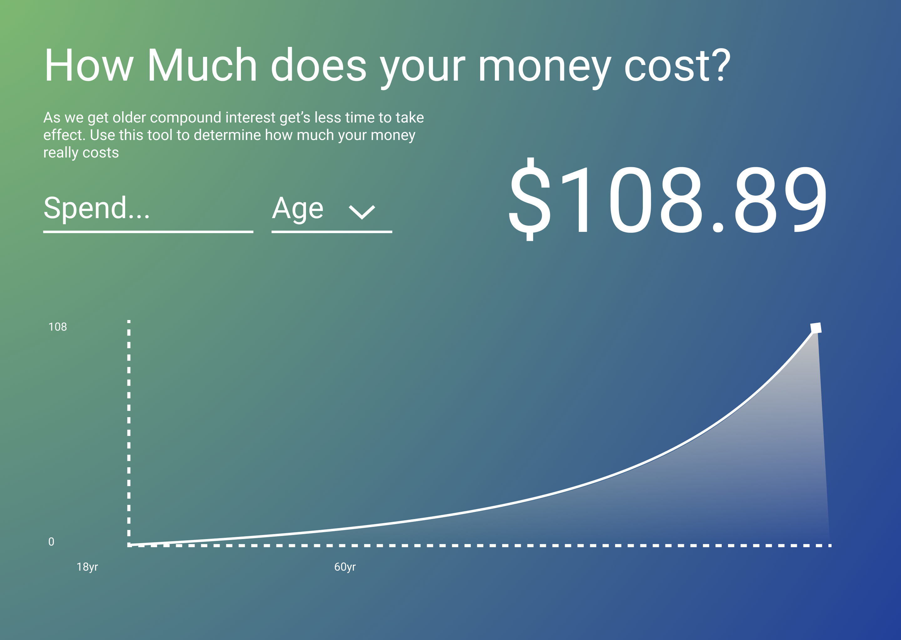
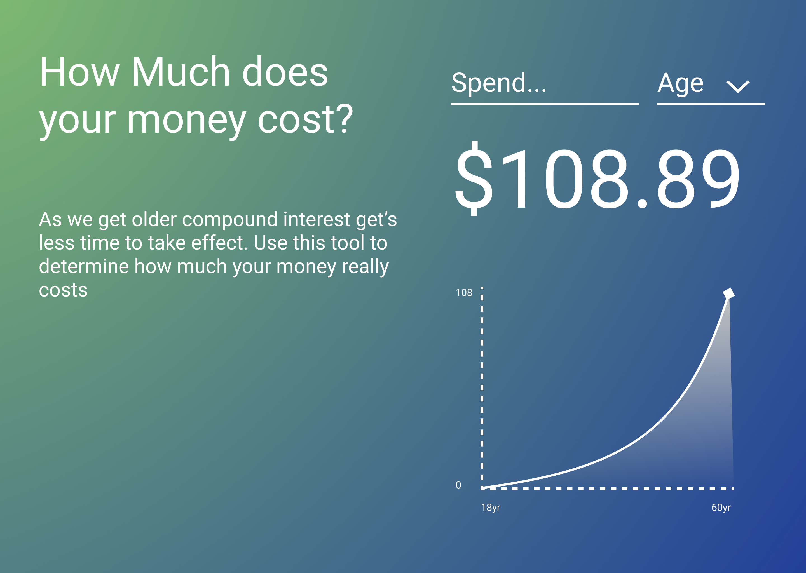
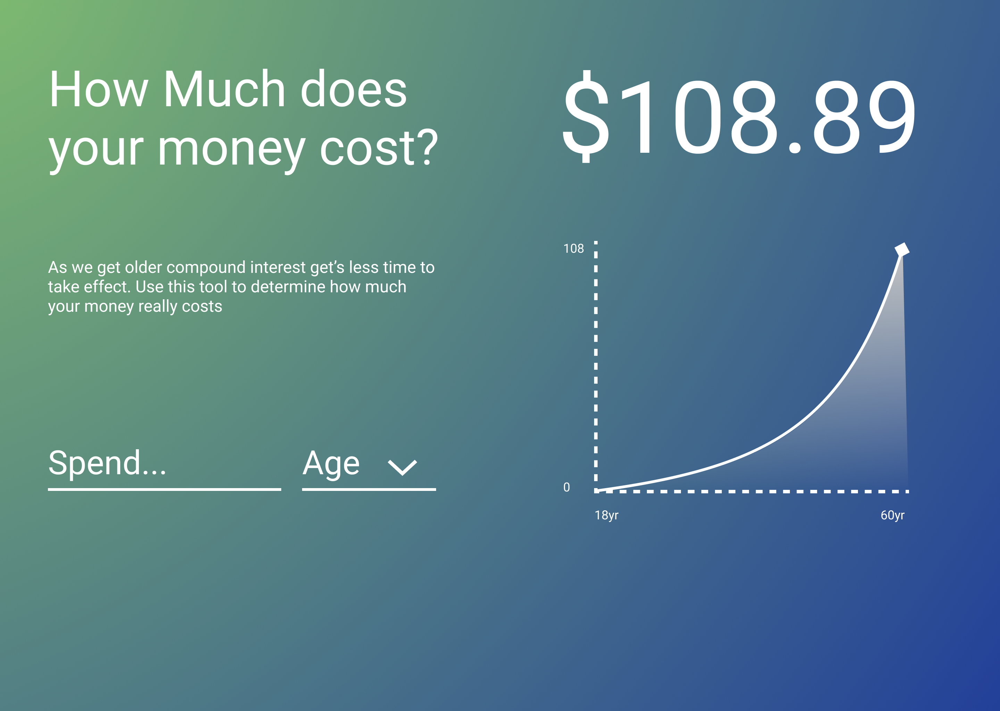

## What is dolarvis?
This labor day I had a little time to myself (and some soreness from hiking the previous days) So I decided to build out a simple app I had in my head. Dollar vis, as it would soon be named, would take in the current amount of money you are thinking about spending and show how much that money would be worth by the time you were 60 accounting for compound interest. Apart from just showing the final amount I also wanted to create a line chart that would show the amount of money you would be accumulating over time.

With these pretty simple requirements I decided to set a mini goal to get this done in a day and got to work.

## Creating a design 
I started off the design by picking a few colors with the [Material Design Color Picker](https://material.io/resources/color/). I don't usually abide by material design practices but I like to use that picker since it shows the primary and secondary colors next to each other. I grabbed a nice light green hue to invoke ideas of money and a deeper contrasting blue to make it appear more approachable.

I've really enjoyed working with gradients recently, they bring a nice natural look to designs in my opinion so I decided to keep it simple and make that the background. With the background sorted I went ahead and created the rest of the elements for the page.

With the inputs sorted I mocked up a quick layout of the page to see where everything looked on the page.

 

I didn't hate the first layout but wanted to do a few more and pick from my favorites.

 
 
 

I wasn't madly in love with any of them, but the last one was good enough for an initial prototype. If I was doing this for a client and this was the final design iteration this would be the point where I would to a mobile iteration, but since this was a personal project I decided to just target desktop and then add a little mobile support if I had time.

## Setting up the project
I threw some lunch into the oven and decided to set up all the bureaucracy for the app while it was cooking. First I looked around on [namecheap](https://namecheap.com) for a domain, this is putting the cart before the horse a bit but I really didn't want to have to go through renaming all my project files twice on such a time crunch. After a bit of poking around the domain [dolarvis.com](https://dollarvis.com) for pretty cheap so I picked it up. I set up a [github repo](https://github.com/GoldfishPi/dollarvis) and linked it up with netlify.

Finally it was time to pick a framework. I was thinking this was going to be a static site so I was leaning towards gatsby. I thought briefly about using svelte for this project but since I had never done any graphing in svelte and I've done quite a bit of data visualization in react it seemed like a better idea for the time crunch. My end bundle size would have definitely been smaller if I went for svelte but I know I would have spent half the time messing around with tooling and reading the docks, so it wasn't a good fit for the project.

## Adding structure
After pulling down my favorite gatsby typescript boilerplate and killing a bunch of the defaults it was time to get started on the project.

To start I added all my colors and font sizes into a stylesheet via css custom properties in `globals.css`. 

```css
:root {
    --primary:#B2FF59;
    --secondary:#234099;

    --white:#FFF;
    --text:var(--white);

    --font-family:Roboto;

    --background:radial-gradient(
    100% 197.75% at 0% 0%, 
    rgba(178, 255, 89, 0.63) 0.12%, 
    rgba(178, 255, 89, 0) 100%
    ), var(--secondary);
    --font-00:16px;
    --font-40:32px;
    --font-80:48px;
    --font-90:52px;
}
```

I created a simple layout with css grid and put in the placeholder text directly into the elements. Eventually this placeholder text would have to be refactored into a `.md` file but that was a future Erik's problem.

I quickly styed made a text input component with `styled-components`.

```typescript
const Input = styled.input`
  background: none;
  border: none;
  color: var(--text);
  font-size: var(--font-40);
  border-bottom: 4px solid var(--text);
  width: 100%;
  padding-bottom: 1rem;
`
```

That was really all I needed to get the basic layout of the page done. Now it's time for the fun component, the graph.

## Creating the graph
I've created graphs like this a few times, it's a pretty standard line chat with a curve but there's still a few things going through.

### Area
The part of the graph that is shaded is an path just like the line is, however we use the `d3.area` generator, which works a bit different.

```typescript
  const a = area()
    .y0(graphHeight)
    .y1((d) => y(d[1]))
    .x((d) => x(d[0]))
    .curve(curveMonotoneX)(data)
```
I set `y0` to be `graphHeight` since I want it to go along the base of the chart. `y1` will track the y of our line so we set that to our scaler and `x` will do the same. I pass in the data at the end of this statement so it's important to keep in mind that `a` is a string and not a generator function.

Finally to use the area just add a `<path/>` tag widh `d` set to our area `a`.

```jsx
<path d={a} />
```

This well create a solid area, but im my design I added a gradient that went from the top of the are down. This is pretty easy to do in svg you just need to know how.

```jsx
<defs>
  <linearGradient id="gradient" y2={0} x1={1} x2={1} y1={1}>
    <stop offset="0%" stopColor="rgba(0,0,0,0)" />
    <stop offset="100%" stopColor="var(--white)" />
  </linearGradient>
</defs>
```


## Putting it all together
Finally it was time to implement some functionality. To start with the base compound interest helper function.

```typescript
const calculateCompoundInterest = (p: number, interestRate: number, time: number) => Math.round(p * (1 + interestRate) ** time)
```

Then I needed to wire up a few peices of state for my inputs.

```typescript
const [age, setAge] = React.useState<number>()
const [principal, setPrincipal] = React.useState<number>()
```

I also added some state hooks for interest and my end date since I was going to need them as constants anyway.

```typescript
const [end] = React.useState(60)
const [interestRate] = React.useState(0.07)
```

Now I can calculate the final amount and the trend using a `useMemo` hook.

```typescript
const { trend, total } = React.useMemo(() => {
    if (!principal || !age) return { trend:[], total: 0};
    const total calculateCompoundInterest(principal, interestRate, end - age)
    const trend = [
      ...new Array(age > end ? 0 : end - (age || 0)).fill([0, 0]).map((_, i) => {
        return [i + age, calculateCompoundInterest(principal, interestRate, i)]
      }),
      [end, total]
    ]

    return { trend, total }
}, [age, principal, end, interestRate])
```
The rest of it's just rendering which I won't go through here but you can check out in the [github repo](https://github.com/GoldfishPi/dollarvis) .

## Final thoughts
This project was a lot of fun to make and pretty simple too. There's something strangely addictive about wrighting data visualization in react that makes the whole process really enjoyable.

After I showed it off the project to some friends and family they gave me some good feedback for features that would improve this "mvp" product. I also have some ideas for more complex visualizations for personal finance so don't be surprised if you see some more blog posts about this project in the future.
